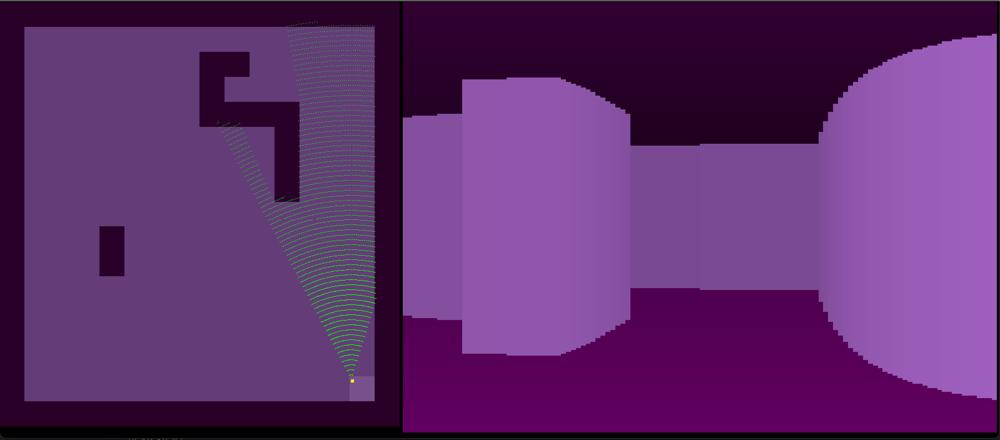

# raycaster

Coded this up to help myself understand the basic idea of raycasting,
the oldest and most basic way of doing 'pseudo 3D' graphics.

This way of doing it is not only terribly inefficient but also
incorrect - if you zoom in on the screenshot, you can see the green
wave at the top is going 'too deep', too far before it hits the wall,
and this distorts the perspective because the distance to the wall is
too far.

I also have the 'fisheye' effect because the distances to the player
are calculated, so the walls on the left of our vision are
(incorrectly) considered further away than the walls in the center
of our view, even if they're all just straight in front of us.

Anyway this didn't take long and was really instructive, I'd recommend
trying it for yourself.

How does a raycaster work? Explained by youtuber Javidx9
https://www.youtube.com/watch?v=xW8skO7MFYw&t=536s

Great book on the optimizations of 'Wolfenstein 3D', a raycasting game
optimized to the point where it could run on extremely slow 386 computers:
https://www.amazon.co.jp/dp/B0768B3PWV
